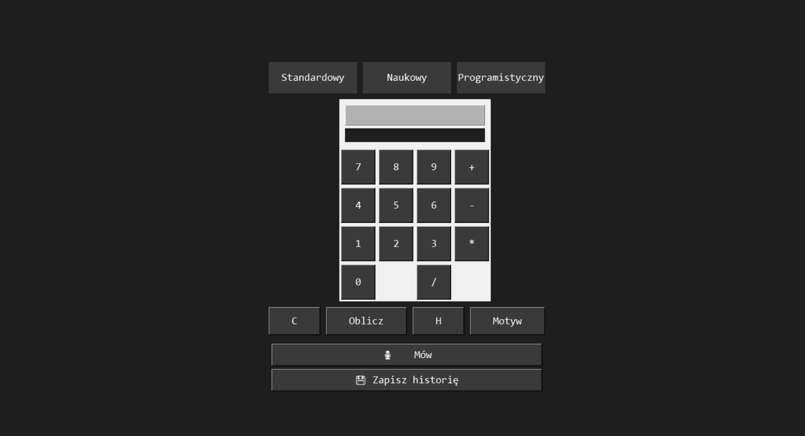
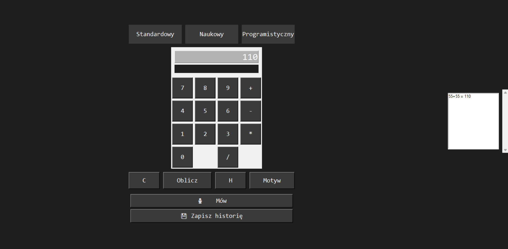

# Calculator
A simple calculator made in Python using `tkinter`. Features include standard, scientific, and programmer modes, dark mode support, history saving, and voice input powered by `SpeechRecognition`.

## 🚀 Features

- **Three Modes:** Standard, Scientific, and Programmer
- **Dark Mode Toggle:** Switch between light and dark themes
- **History Panel:** Save, view, and reuse previous calculations
- **Voice Recognition:** Speak expressions in Polish
- **Syntax Validation:** Prevents invalid math expressions
- **Keyboard Shortcuts:** For fast and easy navigation
- **Support for Binary, Decimal, Bitwise operations**
- **Scientific functions:** log, sin, cos, sqrt, pi, e

## 🧠 Technologies Used

- **Python 3**
- `tkinter` (GUI)
- `sympy` (math parsing)
- `speech_recognition` (voice input)
- `re` (regex validation)

## 📷 Screenshots

